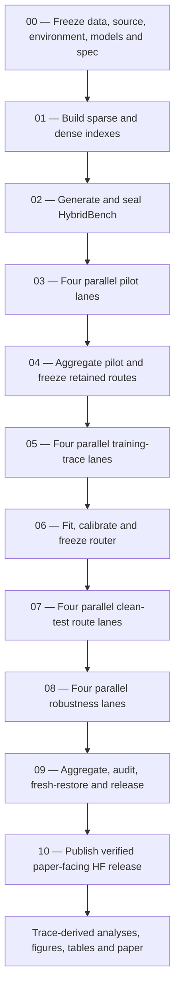

# E2AM-MemRAG

[](https://github.com/Shanmuk4622/E2AM-MemRAG/actions/workflows/ci.yml)

**A failure-first study of action-pool routability, grounding utility, and
selected-GPU generation energy in small-model RAG systems.**

> **Current status — July 2026:** the `e2am-memrag-v3r1` experiment is complete,
> consolidated, checksum-verified, analyzed, and written as a research paper. The
> predeclared energy-saving router hypothesis did **not** pass. That negative result
> is preserved and is now the starting point of the paper's main contribution: a
> router should not be optimized until its candidate action pool is shown to contain
> adequate capability and query-dependent routing headroom.

## Table of contents

- [Project in one minute](#project-in-one-minute)
- [What problem are we studying?](#what-problem-are-we-studying)
- [What we built](#what-we-built)
- [Scientific questions](#scientific-questions)
- [System and experiment design](#system-and-experiment-design)
- [Execution pipeline and completed progress](#execution-pipeline-and-completed-progress)
- [Results](#results)
- [What we observed](#what-we-observed)
- [What succeeded and what failed](#what-succeeded-and-what-failed)
- [Research contribution and novelty](#research-contribution-and-novelty)
- [Scope and claim boundaries](#scope-and-claim-boundaries)
- [Artifacts and provenance](#artifacts-and-provenance)
- [Repository structure](#repository-structure)
- [Reproducing the work](#reproducing-the-work)
- [Future direction](#future-direction)
- [How to explain or share this project](#how-to-explain-or-share-this-project)
- [Frequently asked questions](#frequently-asked-questions)

## Project in one minute

E2AM-MemRAG began as an experiment in jointly selecting a language model and a
retrieval/memory strategy under strict answer-quality and GPU-energy constraints.
Five pinned small language models were evaluated through direct generation,
retrieval-augmented generation, external-memory mechanisms, verification, and
abstention routes. A two-stage calibrated router was then trained using only
query-available information and a charged retrieval/memory probe.

The complete experiment covers:

- 800 deterministic scenario groups;
- eight evidence and memory task classes;
- five pinned language-model repositories;
- 22 declared route configurations before pilot pruning;
- 17 retained clean-test routes and 11 resident-eligible router actions;
- 2,040 clean-test route–query traces;
- 1,440 robustness traces across four corruption conditions;
- selected-T4 board energy sampled around `model.generate()`;
- 23 standalone, resumable Kaggle notebooks;
- content-addressed Hugging Face checkpoints, traces, manifests, and closure seals.

The frozen learned controller selected `A03_tiny_hybrid` for every test query. It
achieved 0% strict success and saved exactly 0 J/query relative to the stored
baseline execution, so the confirmatory hypothesis failed. Post-hoc analysis then
showed why: the 11-action resident-eligible pool had a best-fixed success of 12.5%
and a per-query oracle ceiling of the same 12.5%. All 15 successes came from one
direct route. There was no query-dependent success complementarity for a router to
learn.

The broader offline reference pool behaved differently: its best fixed action
reached 44.2%, its label-aware oracle reached 72.5%, and it contained 28.3
percentage points of routing headroom. This contrast changes the central research
question from **“Which router should we train?”** to **“Is the available action pool
routable in the first place?”**

## What problem are we studying?

A RAG router chooses an action for each query. An action may specify:

- the generator;
- whether retrieval is used;
- the retrieval method;
- the external-memory organization;
- prompt and context construction;
- verification and citation requirements;
- abstention or fallback behavior.

Most routing studies begin by fitting a selector. That skips a more basic question:
do the candidate actions already contain useful differences?

If one action succeeds on every query that any other eligible action can solve,
then a learned selector cannot improve strict success over that action. Better
features, calibration, thresholds, or classifiers cannot manufacture missing model
capability or action complementarity.

E2AM-MemRAG therefore studies two linked problems:

1. **Prospective routing:** can a frozen cost-aware controller reduce measured GPU
   generation energy while preserving strict quality, execution coverage, and
   abstention requirements?
2. **Pre-routing diagnosis:** before fitting or blaming a controller, does the
   eligible action pool pass interface, capability, complementarity, cost, and
   constrained-selection checks?

## What we built

### 1. A controlled RAG and memory benchmark

HybridBench contains 800 synthetic but controlled scenario groups. Every scenario
has deterministic facts, documents, memory events, task labels, evidence
requirements, and forbidden evidence. The benchmark is designed for mechanism
diagnosis rather than public-leaderboard competition.

The eight task classes are:

1. no retrieval;
2. knowledge only;
3. memory only;
4. knowledge plus memory;
5. temporal update;
6. authority conflict;
7. two-hop hybrid reasoning;
8. deleted or missing evidence.

The benchmark contains 5,600 documents and 2,400 memory events. Scenario groups
are split without template-family leakage:

| Split | Fraction | Scenario groups | Purpose |
| --- | ---: | ---: | --- |
| Pilot | 10% | 80 | Route and hardware feasibility; frozen pruning only |
| Router train | 50% | 400 | Outcome, energy, and latency models |
| Calibration | 15% | 120 | Probability calibration |
| Validation | 10% | 80 | Threshold and fallback selection |
| Sealed test | 15% | 120 | Final clean and robustness evaluation |

### 2. A five-model portfolio

| Role | Frozen repository | Use in v3r1 |
| --- | --- | --- |
| Tiny online model | `Qwen/Qwen3-0.6B` | Resident deployable candidate |
| Small online model | `ibm-granite/granite-4.0-1b` | Resident deployable candidate |
| Peer reference | `HuggingFaceTB/SmolLM3-3B` | Sequential offline reference |
| Granite reference | `ibm-granite/granite-4.1-3b` | Sequential offline reference |
| Upper reference | `Qwen/Qwen3-4B-Instruct-2507` | Sequential offline reference |

The tiny and small models had to coexist on one NVIDIA T4 with at least 15% free
VRAM and without CPU/disk offload. The 3B/4B checkpoints were loaded one at a time
as reference models and were not eligible for online router selection. Therefore,
the observed zero-headroom result is conditional on this frozen resident-set
contract; it is not a claim that the reference models are universally
undeployable.

### 3. A composite action catalog

The original catalog contained 22 direct, retrieval, memory, combined-evidence,
verification, and model-transfer routes. The pilot retained 17 routes. Five
non-anchor routes (`A05`, `A06`, `A07`, `A11`, and `A15`) were removed only by the
frozen pilot rule; all mandatory matched endpoints were preserved.

The retained matrix includes:

- direct generation;
- BM25 retrieval;
- dense retrieval with `all-MiniLM-L6-v2`;
- reciprocal-rank hybrid retrieval;
- flat, hierarchical, and graph/temporal memory;
- combined retrieval and memory;
- exact citation and evidence guards;
- matched direct/grounded endpoints for all five generators.

### 4. Strict support-qualified evaluation

A response counts as successful only when every scenario-applicable requirement
passes:

- the answer is correct;
- required evidence IDs are recalled;
- every cited ID belongs to the retrieved set;
- citation precision is perfect;
- abstention is correct when evidence is unavailable;
- the required JSON output is parseable;
- deleted or forbidden evidence is not used.

This metric intentionally rejects fluent but unsupported answers. The citation
guard is deterministic; it is not presented as an LLM entailment judge.

### 5. A two-stage calibrated router

Stage 0 uses eight query-available features, including length, counts of entities,
temporal/conflict/memory/multi-hop indicators, and related query structure. If no
direct action satisfies the frozen conservative decision rule, Stage 1 pays for a
BM25/memory-metadata probe and considers non-direct eligible actions.

The router uses:

- five grouped-bootstrap seeds;
- histogram gradient-boosting success classifiers;
- isotonic probability calibration;
- 0.90-quantile energy and latency regressors;
- conservative success as the minimum calibrated probability across seeds;
- nine frozen thresholds from 0.60 through 1.00;
- validation-only threshold and safe-fallback selection.

No validation threshold satisfied the frozen success, coverage, and abstention
requirements. Before test labels were opened, a disclosed amendment fixed
`tau = 1.0` only so the already specified test matrix could be completed. The
amendment prohibited a positive hypothesis claim and retained the
validation-infeasible state in the released policy artifact.

### 6. Generation-window GPU telemetry

The measured energy quantity is the selected NVIDIA T4 board energy during
`model.generate()` only. NVML power is sampled every 50 ms and integrated with the
trapezoidal rule. CUDA is synchronized immediately before and after generation.

The reported energy explicitly excludes:

- CPU retrieval and embedding;
- memory traversal;
- router computation and probe work;
- parsing and deterministic verification;
- model loading and index construction;
- storage and network transfer;
- host idle power and cooling;
- whole-system energy and carbon.

Retrieval, memory, verification, and router/probe components are included in the
latency accounting, but not in the GPU-energy number. Cross-board energy
comparisons are descriptive; same-board matched comparisons are identified
separately.

### 7. A resumable and auditable experiment runtime

Each notebook embeds the same checksum-verified runtime and is self-contained for
Kaggle. The durability layer provides:

- immutable, content-addressed artifacts;
- result shards with at most 128 rows;
- 512-record resumable index shards;
- one durable checkpoint per router bootstrap seed;
- saved manifests, work-plan state, RNG state, metrics, and source/environment
  identities;
- dirty-state sync no more often than every 1,200 seconds;
- forced sync after major stages, normal completion, and catchable interruption;
- fresh-session restore with byte-count and SHA-256 verification;
- fixed worker lanes and optimistic-parent conflict detection;
- fail-closed rejection of mixed specs, divergent duplicates, non-finite metrics,
  corrupt closures, or secret-like content.

A hard VM kill cannot execute cleanup, so the smallest unsealed unit may need to be
replayed. It does not require restarting the full experiment.

## Scientific questions

The completed paper is organized around four research questions:

1. **Routability:** does the resident-eligible action pool contain enough absolute
   capability and query-dependent complementarity to justify router optimization?
2. **Retrieval versus utilization:** when retrieved evidence is held constant,
   where does utility disappear between retrieval, parsing, generation, citation,
   and verification?
3. **Interaction and cost:** how do generator family and task class change the
   strict-success and selected-GPU generation-energy effect of grounding?
4. **Protocol consequence:** can the frozen controller satisfy its validation
   constraints, and does its sealed-test behavior agree with the action-pool audit?

## System and experiment design



Parallel stages use frozen route-affinity partitions. Every clean-test lane
evaluates all 120 sealed queries for its assigned routes, and only the coordinator
joins the disjoint route columns. Two live processes must never share one lane.

The test labels are opened only after the router, threshold set, analysis freeze,
and gate exist. This is a procedural seal backed by workflow checks, not a claim of
cryptographic isolation from the repository owner.

## Execution pipeline and completed progress

The repository contains **23** standalone Kaggle notebooks: 22 notebooks through
the authoritative Stage-09 experiment release, plus the Stage-10 post-release
consolidation notebook.

| Phase | Notebook(s) | Output | Current state |
| --- | --- | --- | --- |
| Freeze | `00_setup_and_freeze_data.ipynb` | Data, source, environment, model and execution contracts | **Complete** |
| Indexing | `01_build_indexes.ipynb` | Frozen sparse/dense indexes | **Complete** |
| Benchmark | `02_build_and_freeze_hybridbench.ipynb` | Grouped HybridBench bundle and sealed labels | **Complete** |
| Pilot | `03_pilot_routes_lane_00` … `lane_03` | Hardware/route feasibility and pilot traces | **Complete** |
| Pilot aggregation | `04_aggregate_and_prune_pilot.ipynb` | Frozen 17-route clean matrix | **Complete** |
| Router traces | `05_collect_training_traces_lane_00` … `lane_03` | Train/calibration/validation traces | **Complete** |
| Router | `06_train_and_calibrate_router.ipynb` | Five-seed models, calibration and frozen amendment | **Complete; no feasible threshold** |
| Clean evaluation | `07_evaluate_frozen_clean_lane_00` … `lane_03` | Exact 17 × 120 sealed-test matrix | **Complete** |
| Robustness | `08_run_robustness_lane_00` … `lane_03` | Four-condition robustness matrix | **Complete** |
| Release | `09_aggregate_audit_and_release.ipynb` | Candidate, fresh-root verification, `_SUCCESS` and hypothesis result | **Complete** |
| Consolidation | `10_consolidate_verified_hf_release.ipynb` | Paper-facing data on HF main and frozen paper branch | **Complete** |
| Analysis | Local trace-derived scripts | Audits, CSVs, tables and figures | **Complete** |
| Paper | Modular IEEE LaTeX | 18-page PDF and Overleaf package | **Complete locally** |

Experiment completion and scientific hypothesis success are different statuses.
The pipeline and release completed successfully; the confirmatory hypothesis did
not pass.

## Results

### Release verdict

| Gate | Result | Meaning |
| --- | --- | --- |
| Experiment completion | **PASS** | Frozen work plan completed and released |
| Fresh-root restore | **PASS** | Stage-09 candidate restored into an empty root and reverified |
| Quality non-inferiority | **PASS, non-informative** | Policy and baseline used the identical stored route executions |
| Coverage and abstention gates | **PASS** | Execution coverage and accounting were complete |
| Energy reduction | **FAIL** | Policy-minus-baseline energy was exactly 0 J/query |
| Joint confirmatory hypothesis | **FAIL** | The required conjunction was false |

The non-inferiority pass must not be interpreted as evidence of a useful router.
It arises from an identity comparison with the same baseline traces.

### Was the action pool routable?

For action set \(\mathcal{A}\), the post-hoc audit compares:

- \(B(\mathcal{A})\): the success rate of the best single fixed action;
- \(O(\mathcal{A})\): a label-aware per-query oracle that selects any successful
  action;
- \(H(\mathcal{A}) = O(\mathcal{A}) - B(\mathcal{A})\): observed routing headroom.

This best-fixed/virtual-best comparison is established algorithm-selection
practice. The project does not claim that the subtraction itself is new. Its role
is to expose whether composite RAG actions are worth optimizing before a router is
credited.

| Action pool | Actions | Best fixed | Per-query oracle | Headroom |
| --- | ---: | ---: | ---: | ---: |
| Frozen resident-eligible pool | 11 | 12.5% | 12.5% | **0.0 pp** |
| Granite 3B matched pair | 2 | 44.2% | 65.0% | 20.8 pp |
| SmolLM3 3B matched pair | 2 | 34.2% | 55.8% | 21.7 pp |
| Qwen 4B matched pair | 2 | 42.5% | 55.8% | 13.3 pp |
| Offline reference pool | 6 | 44.2% | 72.5% | **28.3 pp** |
| All 17 retained routes | 17 | 44.2% | 73.3% | **29.2 pp** |

All 15 successes in the resident-eligible pool came from `A00_tiny_direct`. No
other eligible action contributed a unique success. Consequently, no per-query
selector—learned or otherwise—could improve strict success over A00 on the frozen
120-query test matrix using those same eligible actions.

The five failure-first audit gates were:

| Audit question | Status | Evidence |
| --- | --- | --- |
| Interface compatibility | **PARTIAL** | Three retained endpoints had 0% parseability |
| Absolute capability | **FAIL** | Resident-pool oracle 12.5% versus frozen 80% requirement |
| Complementarity | **FAIL** | Resident-pool routing headroom 0.0 pp |
| Physical-cost comparability | **QUALIFIED** | Complete generation telemetry, but traces span four physical T4 boards |
| Constrained selectability | **FAIL** | 0 of 9 validation thresholds were feasible |

### Frozen learned-policy result

| Quantity | Result |
| --- | ---: |
| Test queries | 120 |
| Selected route | `A03_tiny_hybrid` for all 120 |
| Strict success | 0.0% |
| 95% query-cluster interval | [0.0%, 0.0%] |
| Mean selected-GPU generation energy | 143.16 J/query |
| 95% interval | [138.14, 148.07] J/query |
| Median selected-route generation duration | 3.47 s |
| Full policy latency including frozen components | 3.76 s/query |
| Abstention rate | 15.0% |
| Execution coverage | 100% |
| Success difference versus baseline | 0.00 pp |
| Energy difference versus baseline | 0.00 J/query |

This was not an execution crash. Every clean unit completed, energy coverage was
100%, and the release contains no execution failures. The policy simply had no
useful resident action to select under its frozen constraints.

### Direct versus grounded model effects

Grounding was not uniformly beneficial. Effects below are
`grounded − direct` over the same 120 queries.

| Generator family | Strict-success effect | 95% interval | Mean GPU-energy effect | Same board? |
| --- | ---: | ---: | ---: | --- |
| Qwen 0.6B | **−12.50 pp** | [−18.33, −6.67] | +146.72 J/query | Yes |
| Granite 1B | 0.00 pp | [0.00, 0.00] | +3.88 J/query | No |
| Granite 3B | **+23.33 pp** | [+10.00, +37.50] | +119.53 J/query | Yes |
| SmolLM3 3B | +10.83 pp | [−2.50, +24.17] | +41.52 J/query | Yes |
| Qwen 4B | **+29.17 pp** | [+16.67, +41.67] | +171.71 J/query | Yes |

The tiny-model decrease does not prove that retrieval is generally harmful.
Its 15 direct successes came from no-retrieval questions; the grounded interface
lost those successes and added none on evidence-required tasks. This is an
end-to-end generator–prompt–parser compatibility result under one frozen contract.

### Retrieval availability versus evidence utilization

All five grounded endpoints received the same ordered evidence IDs on all 120 test
queries. Among the 90 evidence-required questions, retrieval was complete for 72
(80.0%), including 14 of 15 two-hop questions. Nevertheless, the strict outcome
varied sharply after retrieval:

| Grounded generator | Retrieval complete | Parse | Complete citations | Valid answer | Valid support | Strict success |
| --- | ---: | ---: | ---: | ---: | ---: | ---: |
| Qwen 0.6B | 80.0% | 32.2% | 0.0% | 0.0% | 0.0% | 0.0% |
| Granite 1B | 80.0% | 0.0% | 0.0% | 0.0% | 0.0% | 0.0% |
| Granite 3B | 80.0% | 95.6% | 77.8% | 58.9% | 82.2% | **58.9%** |
| SmolLM3 3B | 80.0% | 100.0% | 44.4% | 51.1% | 67.8% | **43.3%** |
| Qwen 4B | 80.0% | 85.6% | 68.9% | 56.7% | 73.3% | **56.7%** |

Because retrieval outputs were held constant, these differences arise downstream:
prompt adherence, parsing, answer production, citation use, evidence support, and
abstention.

### Task-aware descriptive oracle

A post-hoc task-aware rule chooses direct generation for no-retrieval and
deleted/missing-evidence tasks and grounding for the other six task classes. It
uses benchmark labels, so it is **not** a trained or deployable policy. It is a
design diagnostic for conditional grounding.

| Generator | Always direct | Always grounded | Task-aware | Gain vs grounded | Energy change vs grounded |
| --- | ---: | ---: | ---: | ---: | ---: |
| Qwen 0.6B | 12.5% | 0.0% | 12.5% | +12.5 pp | −34.97 J/query |
| Granite 1B | 0.0% | 0.0% | 0.0% | 0.0 pp | −1.36 J/query |
| Granite 3B | 20.8% | 44.2% | 65.0% | +20.8 pp | −14.71 J/query |
| SmolLM3 3B | 23.3% | 34.2% | 55.8% | +21.7 pp | −13.05 J/query |
| Qwen 4B | 13.3% | 42.5% | 55.8% | +13.3 pp | −30.32 J/query |

The constructive implication is conditional grounding: retrieve only when the
task needs evidence and only when the selected generator can use the frozen
grounded interface.

### Success-preserving cost bound inside the resident pool

Zero success headroom does not mathematically imply zero cost headroom. A
label-aware cost oracle that preserves all 15 A00 successes selects A00 on 119
queries and A03 on one A00-failure query. It reduces the recorded mean from
54.71385 to 54.66494 J/query: a saving of 0.04891 J/query, or 0.089%.

This is negligible and post hoc, but it prevents an exaggerated statement. The
resident pool had **zero observed success headroom**, not literally zero possible
cost variation.

### Robustness result

The selected policy achieved 0% strict success on clean data and 0% under all four
corruption conditions:

- conflict injection;
- deletion and duplicate ordering;
- missing evidence;
- stale evidence.

Execution coverage was 100% in every condition, and prompt-injection compromise
was 0%. These are not positive robustness findings because useful strict success
was already at the floor. A zero degradation from zero is a floor effect.

### Trace integrity

| Trace release | Rows | Routes | Queries | Strict successes | Parse rate | Support rate | Energy coverage | Execution failures |
| --- | ---: | ---: | ---: | ---: | ---: | ---: | ---: | ---: |
| Clean | 2,040 | 17 | 120 | 229 (11.2%) | 58.4% | 18.0% | 100% | 0 |
| Robustness | 1,440 | 3 | 120 | 60 (4.2%) | 49.8% | 6.7% | 100% | 0 |

Both releases contain zero duplicate unit IDs, zero divergent route hashes, and
zero non-finite audited values.

<details>
<summary><strong>All 17 retained clean-test routes</strong></summary>

| Route | Description | Strict success | Mean GPU J/query | Median generation s |
| --- | --- | ---: | ---: | ---: |
| `A00_tiny_direct` | Qwen 0.6B direct | 12.5% | 54.71 | 1.44 |
| `A01_tiny_bm25` | Qwen 0.6B + BM25 | 0.0% | 157.68 | 3.41 |
| `A02_tiny_dense` | Qwen 0.6B + dense retrieval | 0.0% | 150.41 | 3.47 |
| `A03_tiny_hybrid` | Qwen 0.6B + hybrid retrieval | 0.0% | 143.16 | 3.47 |
| `A04_small_direct` | Granite 1B direct | 0.0% | 256.98 | 4.12 |
| `A08_tiny_memory_flat` | Qwen 0.6B + flat memory | 0.0% | 148.96 | 3.42 |
| `A09_tiny_memory_hier` | Qwen 0.6B + hierarchical memory | 0.0% | 170.32 | 3.39 |
| `A10_tiny_memory_graph` | Qwen 0.6B + graph/temporal memory | 0.0% | 171.49 | 3.37 |
| `A12_small_hybrid_both` | Granite 1B + retrieval and memory | 0.0% | 258.54 | 4.02 |
| `A13_small_hybrid_verified` | Granite 1B grounded and verified | 0.0% | 260.85 | 4.03 |
| `A14_upper_hybrid_verified` | Qwen 4B grounded and verified | 42.5% | 256.13 | 3.79 |
| `M16_tiny_grounded_verified` | Qwen 0.6B matched grounded endpoint | 0.0% | 201.44 | 3.66 |
| `M17_granite_direct` | Granite 3B direct | 20.8% | 57.14 | 0.45 |
| `M18_granite_grounded_verified` | Granite 3B grounded and verified | **44.2%** | 176.68 | 2.65 |
| `M19_peer_direct` | SmolLM3 3B direct | 23.3% | 107.42 | 1.67 |
| `M20_peer_grounded_verified` | SmolLM3 3B grounded and verified | 34.2% | 148.93 | 2.34 |
| `M21_upper_direct` | Qwen 4B direct | 13.3% | 84.42 | 1.25 |

These are route-level descriptive means. Rankings across different physical T4
boards are not causal architecture-efficiency comparisons.

</details>

## What we observed

### Observation 1: the main failure preceded router learning

The strongest explanation is not “the classifier was weak.” The resident action
pool lacked both absolute capability and unique per-query successes. A perfect
label-aware selector could not beat the 12.5% fixed direct route on strict success.

### Observation 2: a route catalog is not automatically a useful action pool

Seventeen route names can still collapse to one useful success set. Retrieval,
memory, and verification variants create nominal diversity, but routing requires
outcome diversity: different actions must solve different queries.

### Observation 3: retrieval success and RAG success are different events

Identical evidence reached every grounded generator, but their ability to parse the
contract, answer, cite, support, and abstain differed dramatically. Improving the
retriever alone would not fix the observed endpoints.

### Observation 4: grounding is a generator–task interaction

Always retrieve and never retrieve were both poor global policies. Grounding
helped capable 3B/4B models on evidence-bearing tasks, but it increased generation
work and could remove direct-task successes. A useful future policy needs both an
evidence-need signal and a generator/interface capability signal.

### Observation 5: the interface is part of the action

Three Granite-1B routes produced no parseable output under the repeated frozen
JSON/prompt contract. The checkpoint loaded and executed, so this was an
operational compatibility failure rather than a missing model. Model, prompt,
schema, tokenizer, citation guard, and parser together define the action.

### Observation 6: grounding increased measured generation work

For the four same-board matched pairs, grounded prompts added input tokens and
generation duration and increased selected-GPU generation energy. This is not the
same as end-to-end RAG energy because CPU retrieval and other system components
were outside the measurement boundary.

### Observation 7: an honest negative result can be more useful than a forced win

The pipeline preserved the validation-infeasible policy, completed the sealed test,
and reported the failed hypothesis. The failure-first audit now provides an
actionable design rule: measure interface compatibility, capability, unique
contributions, oracle headroom, cost comparability, and validation feasibility
before spending effort on router optimization.

## What succeeded and what failed

### What succeeded

- A large multi-stage experiment was completed across distributed Kaggle lanes.
- All durable results were restored and checksum-verified from Hugging Face.
- The exact clean and robustness matrices were complete with no missing units.
- The single-T4 resource contract, frozen revisions, leakage controls, and test
  seal were enforced.
- Energy telemetry covered every primary clean and robustness row.
- The experiment survived network failures, stalled model downloads, session
  restarts, lane-specific errors, and Hugging Face rate limits without silently
  changing the scientific configuration.
- The failure mechanism was localized using existing immutable traces; no new
  model inference was needed for the final diagnosis.
- A complete research manuscript, figures, tables, audit, and reproducible source
  package were produced.

### What failed

- No frozen threshold met all validation constraints.
- The resident action pool reached only a 12.5% oracle ceiling against an 80%
  operating requirement.
- The resident pool had 0.0 percentage points of strict-success routing headroom.
- The frozen test policy selected one fail-closed fallback for every query.
- The policy achieved 0% strict success and no GPU-energy reduction.
- The joint confirmatory hypothesis did not pass.
- The robustness policy remained at a zero-success floor, so no useful robustness
  claim is available.

These failures do not invalidate the completion of the experiment. They determine
the claim the evidence can honestly support.

## Research contribution and novelty

The project should not be presented as “we invented a RAG router” or “the router
reduced energy.” Current RAG literature already includes learned retrieval,
generator, memory, and resource-routing methods. Best-fixed versus virtual-best
oracle analysis is also established in algorithm selection.

The defensible contribution is the integrated **failure-first RAG action-pool
audit**:

1. validate the model–prompt–runtime interface;
2. measure the pool's absolute capability;
3. measure unique success contributions and query-level headroom;
4. qualify the physical cost boundary and hardware comparability;
5. test whether any decision threshold satisfies the operating constraints;
6. only then interpret or optimize a learned router.

The empirical contribution is a complete counterexample to the assumption that a
large route catalog necessarily provides a useful decision space. The
resident-eligible pool had zero success headroom while the offline reference pool
had 28.3 points. The retrieval-to-utilization and generator–task analyses explain
where the difference arose.

The paper is therefore positioned as a reproducible negative-results, evaluation,
and systems-diagnosis study—not as a state-of-the-art router paper.

## Scope and claim boundaries

### Supported by the evidence

- The frozen `e2am-memrag-v3r1` experiment completed successfully.
- The predeclared joint hypothesis failed.
- The 11 resident-eligible actions had zero observed strict-success headroom on the
  120-query sealed test.
- The eligibility result is conditional on the frozen co-resident T4 contract.
- The offline reference pool contained substantial descriptive oracle headroom.
- Grounding utility depended strongly on generator and task class.
- All grounded endpoints received the same retrieved evidence IDs.
- Grounding increased generation-window selected-GPU energy in all five matched
  means; four comparisons were on the same physical board.
- The frozen controller had no validation-feasible threshold.
- The robustness zero deltas were floor effects.

### Not supported by the evidence

- That the learned router reduced energy while preserving useful quality.
- That the task-aware or per-query oracles are deployable policies.
- That retrieval is universally harmful to small models.
- That 0% prompt-injection compromise proves a useful robust system.
- That selected-GPU generation energy equals end-to-end or whole-system energy.
- That cross-board energy differences isolate architecture efficiency.
- That the synthetic benchmark establishes public-benchmark superiority.
- That the results generalize to production workloads, arbitrary domains, other
  hardware, newer model revisions, or unconstrained dynamic loading.
- That any environmental or carbon reduction was measured.

## Artifacts and provenance

### Research paper

- [Final paper PDF](output/pdf/E2AM_MemRAG_Paper.pdf)
- [Overleaf-ready source package](output/latex/E2AM_MemRAG_Overleaf.zip)
- [LaTeX entry point](paper/manuscript/main.tex)
- [Reviewer-led restructuring report](paper/REVIEWER_REPORT.md)
- [Results and claim audit](paper/RESULTS_AUDIT.md)
- [Publication blueprint](paper/PAPER_BLUEPRINT.md)

The compiled manuscript is 18 pages and contains 52 cited bibliography entries,
17 tables, and four principal figures. Its claims are checked automatically against
the frozen CSV/JSON evidence.

### Frozen release

| Item | Value |
| --- | --- |
| Experiment ID | `e2am-memrag-v3r1` |
| Hugging Face dataset | `Shanmuk4622/E2AM-MemRAG-Traces` |
| Visible release commit | `0b2405d9cca43fd04e35f792fdc4664405154fc6` |
| Paper branch commit | `00fa353f273f3a4b3d57a0b998301c85a1bc098b` |
| Stage-09 artifacts | 11 of 11 verified |
| Verified Stage-09 bytes | 11,528,142 |
| Frozen execution-spec SHA-256 | `1c8f29fd250b87d3546c6ff3d128dc3fe6600bc798c3c0b0b8c98e0b95c76cfc` |

Repository visibility must be checked before sharing. If the Hugging Face dataset
remains private, provide reviewer access or a checksum-identical anonymous archive;
do not claim unrestricted public availability.

### Paper-facing derived data

`paper/data/derived/` contains machine-readable tables for:

- route statistics and hardware assignment;
- trace integrity;
- action-pool headroom and unique contributions;
- five audit gates;
- controlled grounding contrasts;
- retrieval-to-utilization decomposition;
- generator–task grounding interactions;
- task-aware descriptive choices;
- success-preserving cost bounds;
- energy mechanisms;
- robustness and threshold sensitivity;
- confirmatory hypothesis gates.

`paper/RESULTS_MANIFEST.json` records the byte count and SHA-256 of every packaged
paper artifact.

## Repository structure

```text
E2AM-MemRAG/
├── configs/                         frozen runtime and experiment defaults
├── docs/
│   ├── RESEARCH_PLAN_V3.md          original v3 research plan
│   ├── SCIENTIFIC_CONTRACT.md       estimands, gates and claim boundaries
│   └── FAILURE_RECOVERY.md          durability and restart contract
├── notebooks/
│   ├── 00_... through 10_...        23 standalone Kaggle notebooks
│   └── README.md                    exact execution order and troubleshooting
├── src/e2am_memrag/                 benchmark, routing, telemetry and storage runtime
├── scripts/
│   ├── build_experiment_notebooks.py
│   ├── collect_paper_results.py
│   ├── build_manuscript_assets.py
│   ├── render_manuscript_figures.py
│   ├── validate_manuscript.py
│   ├── package_manuscript.py
│   └── update_paper_manifest.py
├── tests/                            CPU-safe runtime and manuscript regression tests
├── paper/
│   ├── data/raw/                     checksum-verified Stage-09 snapshot
│   ├── data/derived/                 trace-derived analyses
│   ├── manuscript/                   modular IEEE LaTeX source
│   ├── RESULTS_AUDIT.md
│   └── REVIEWER_REPORT.md
└── output/
    ├── pdf/E2AM_MemRAG_Paper.pdf
    └── latex/E2AM_MemRAG_Overleaf.zip
```

## Reproducing the work

### Kaggle requirements

For each fresh Kaggle session:

1. enable Internet;
2. select a GPU accelerator for experimental stages;
3. add `HF_TOKEN` as a Kaggle Secret with appropriate access to
   `Shanmuk4622/E2AM-MemRAG-Traces`;
4. run the correct numbered notebook with **Run All**;
5. never run the same lane in two live sessions;
6. wait for both `REMOTE_CLOSURE_VERIFIED` and `STAGE_COMPLETE`.

The primary scientific runs expose only one T4 before importing Torch or any
CUDA-aware package. A dual-T4 session may be allocated, but the experiment does
not silently turn it into a multi-GPU run.

See [notebooks/README.md](notebooks/README.md) for exact stage/lane ownership,
restart instructions, expected messages, and troubleshooting.

### Local runtime checks

```powershell
$env:PYTHONPATH = "$PWD\src"
python -m unittest discover -s tests -p 'test_*.py'
python scripts/build_experiment_notebooks.py --check
```

### Rebuild the paper analyses

The paper analyses reuse sealed traces and do not invoke an LLM:

```powershell
python scripts/collect_paper_results.py
python scripts/build_manuscript_assets.py
python scripts/render_manuscript_figures.py
python scripts/validate_manuscript.py
python -m unittest tests.test_manuscript -q
```

Compile `paper/manuscript/main.tex` with Tectonic or upload the complete
`paper/manuscript/` directory to Overleaf using pdfLaTeX. Then package and finalize
the checksum inventory:

```powershell
python scripts/package_manuscript.py
python scripts/update_paper_manifest.py
python -m unittest tests.test_paper_results -q
```

### Stop and restart behavior

- For a manual interruption, interrupt once and wait for `SAFE_STOP_VERIFIED`.
- After a Kaggle VM loss, reopen the same notebook and choose **Run All**.
- Verified units are restored and skipped; only missing or unsealed units replay.
- Do not lower precision, batch size, context, or change device placement after an
  OOM inside the frozen experiment. Such a change requires a new spec and
  experiment ID.
- Never paste a Hugging Face token into code, notebook output, Git, documentation,
  or chat. The runtime reads only `HF_TOKEN` from the secret/environment store.

## Future direction

### Immediate work that does not require another experiment

1. Create a tagged GitHub release containing the paper PDF, Overleaf package, and
   results manifest.
2. Make the trace dataset reviewer-accessible or produce a checksum-identical
   anonymous archive.
3. Add a dataset card and artifact-evaluation guide that reproduces every paper
   table directly from sealed traces.
4. Adapt the LaTeX front matter and anonymization to the selected venue without
   changing the claims.
5. Add a compact project page or trace-exploration dashboard showing the five audit
   gates, route matrix, and grounding interactions.
6. Archive the release with a DOI if long-term public preservation is desired.

### Scientific next steps for a separate v4 study

These are future hypotheses, not missing requirements for the completed v3r1
paper:

1. **Audit before training.** Run interface, capability, unique-contribution, and
   headroom gates on pilot/validation data before fitting a router.
2. **Redesign the eligible pool.** Include at least two capable actions with
   demonstrably different success sets. Dynamic loading, quantization, or newer
   small models would be a new deployment spec rather than a v3r1 patch.
3. **Conditional grounding.** Predict both evidence need and whether the chosen
   generator can use the grounded interface; avoid always-grounded execution.
4. **Interface conformance tests.** Validate prompt/schema/tokenizer/parser
   compatibility before expensive route collection.
5. **End-to-end energy.** Add CPU, retrieval, host, and idle measurements so total
   system energy can be analyzed separately from generation-window board energy.
6. **External validity.** Repeat the audit on one or more public, naturally
   occurring knowledge-intensive benchmarks.
7. **Prospective policy evaluation.** Only after a positive validation headroom
   audit, train and evaluate a new constrained router on a newly sealed test set.

The v3r1 artifacts should remain immutable. Any changed model, precision, prompt,
context length, action set, hardware policy, or energy boundary belongs to a new
experiment identifier.

## How to explain or share this project

### 30-second description

> E2AM-MemRAG is a reproducible small-model RAG and memory-routing experiment on
> NVIDIA T4 GPUs. We evaluated five generators and 17 retained direct, retrieval,
> memory, and verified-grounding routes over a sealed controlled benchmark. The
> planned energy-saving router did not succeed. Instead of hiding that result, we
> proved that its 11 resident-eligible actions had zero query-level success
> headroom, while offline 3B/4B reference actions had 28.3 percentage points. The
> project contributes a failure-first audit for deciding whether an action pool is
> worth routing before optimizing a policy.

### What makes the work technically substantial

- distributed, resumable Kaggle execution with immutable Hugging Face closures;
- five-model controlled direct/grounded comparisons;
- strict citation-, support-, abstention-, and parse-qualified evaluation;
- per-query GPU-board telemetry and clustered uncertainty intervals;
- sealed clean and corruption matrices;
- a calibrated constrained router with the negative result preserved;
- trace-derived mechanism analysis, paper, figures, tables, and reproducibility
  package.

### Responsible claims to use

- “The full experiment and release completed.”
- “The confirmatory energy-saving hypothesis failed.”
- “The resident action pool had zero observed strict-success routing headroom.”
- “The reference pool exposed substantial complementarity outside the online
  resource contract.”
- “Identical retrieval outputs produced sharply different grounded outcomes across
  generators.”
- “The work proposes an audit for action-pool feasibility before router training.”

### Claims to avoid

- “The router saved energy.”
- “The system is robust because corruption caused no accuracy loss.”
- “RAG is bad for small language models.”
- “GPU generation joules are the total energy or carbon footprint.”
- “The label-aware oracle is a deployable policy.”
- “The system establishes state-of-the-art QA performance.”

## Frequently asked questions

### What exactly is complete?

All experimental stages through Stage 09, the Stage-10 paper-facing consolidation,
clean evaluation, robustness evaluation, trace verification, derived analyses,
research paper, figures, tables, PDF, and Overleaf package are complete.

### Did the scientific hypothesis succeed?

No. The required energy-reduction gate failed, so the joint confirmatory
hypothesis is false.

### Is the project a failed project?

No. The planned positive policy claim failed, but the experiment completed and
produced a reproducible diagnosis. The scientifically useful result is that the
eligible action pool was structurally unsuitable for strict-success routing under
the frozen resource contract.

### Were the language models fine-tuned?

No. The language models were evaluated at pinned revisions with frozen decoding.
The learned component is the lightweight routing stack: outcome classifiers,
calibration, and energy/latency regressors. Resume units are inference traces and
router-seed checkpoints, not LLM training epochs.

### Why did the router always choose A03?

No validation threshold satisfied all frozen constraints. The disclosed pre-test
amendment selected the already defined fail-closed fallback at `tau = 1.0`. That
fallback was A03 for every sealed-test query.

### Why did quality non-inferiority pass if success was zero?

The policy and baseline records refer to the same stored A03 executions. Their
paired difference is exactly zero. This is a formal identity result, not evidence
that useful quality was preserved.

### Why is the resident oracle only 12.5%?

Only A00 solved any strict-success cases, and it solved 15 of 120. Every success
achieved by another eligible route, if any, was already included in A00's success
set; no eligible route added a unique query.

### Why can the reference oracle reach 72.5%?

The capable 3B/4B direct and grounded endpoints succeed on different queries.
Their union covers 87 of 120 queries, creating 28.3 percentage points of headroom
over the best fixed reference route. This is a descriptive upper bound, not a
deployable router result.

### Did retrieval fail?

Not generally. Required evidence was completely retrieved for 80% of the
evidence-dependent test questions, and every grounded generator saw the same
ordered evidence. The largest differences appeared after retrieval in interface
compliance, generation, citation, support, and abstention.

### Did grounding always consume more energy?

All five matched mean differences were positive for the measured generation
window. Four pairs were observed on the same physical board; the Granite-1B pair
was cross-board and is descriptive. This does not include total retrieval or host
energy.

### Why use one T4 when Kaggle can expose two?

The primary contract fixes one visible T4 so device placement, board telemetry,
and comparisons remain controlled. Dual-T4 execution would be a separately labeled
throughput experiment, not a silent implementation change.

### Where are the results stored?

The frozen traces and closures are in `Shanmuk4622/E2AM-MemRAG-Traces`. A verified
paper-facing snapshot is also present under `paper/data/`, with hashes recorded in
`paper/RESULTS_MANIFEST.json`.

### Can the paper be reproduced without rerunning the models?

Yes. The manuscript tables, figures, and claim checks are rebuilt from the sealed
trace snapshot. The paper-generation scripts do not invoke an LLM.

### What is the most important lesson?

Do not assume that more route names create more routing opportunity. Before
training a selector, prove that the candidate actions are compatible, capable,
complementary, physically comparable, and selectable under the intended operating
constraints.

## Author

**Shanmukesh Bonala**

School of Computer Science and Engineering, VIT-AP University, Amaravati, India

For the precise scientific wording, use [paper/RESULTS_AUDIT.md](paper/RESULTS_AUDIT.md)
and the [final manuscript](output/pdf/E2AM_MemRAG_Paper.pdf) as the authoritative
references.
